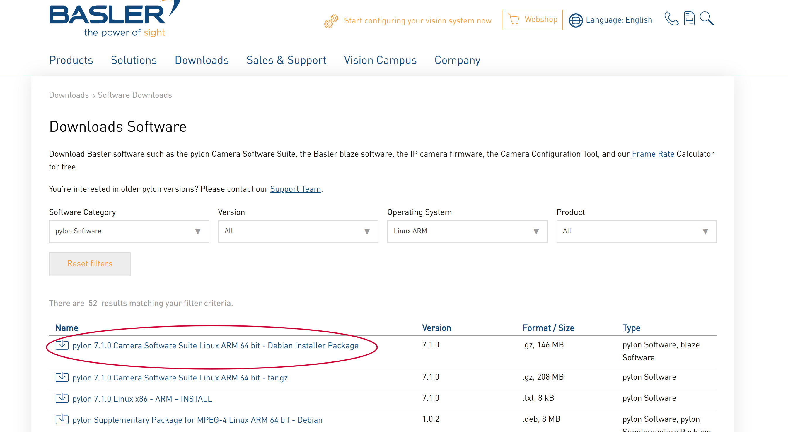
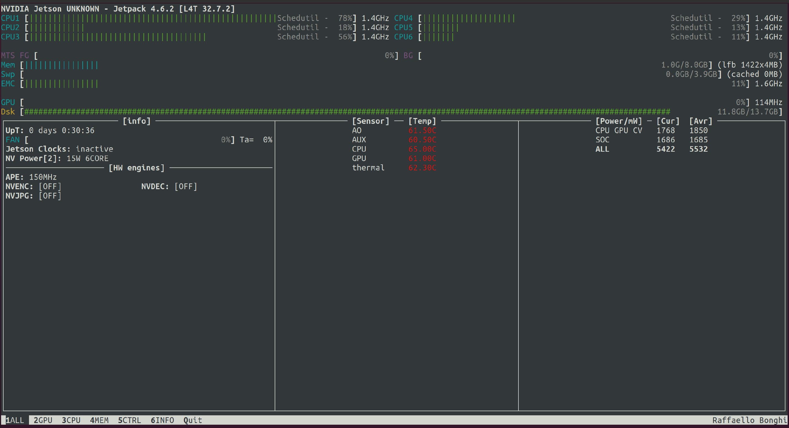

# 1. Hardware

- [NVIDIA® Jetson Xavier™ NX](https://www.nvidia.com/en-us/autonomous-machines/embedded-systems/jetson-xavier-nx/)
- [Quark Carrier for NVIDIA® Jetson Xavier™ NX](https://connecttech.com/product/quark-carrier-nvidia-jetson-xavier-nx/)

Manual for `Quark carrier` [here](https://connecttech.com/ftp/pdf/CTIM_NGX004_Manual.pdf)


# 2. Install from scratch

## 2.1. Prerequisite
Host laptop/VM with Ubuntu 18.04

## 2.2. Download SDK for NVIDIA and install Connect BSP
From [here](https://connecttech.com/resource-center/kdb373/) follow for installing SDK for NVIDIA and Connect driver
and then from [here](https://connecttech.com/resource-center/kdb374/)
choose `JetPack 4.2+` for installing SDK components (CUDA, Opencv ...)

Note:  
From [here](https://developer.nvidia.com/embedded/jetpack-sdk-462#collapseAllJetson) SDK manager for version 4.6.2.  
From [here](https://connecttech.com/product/quark-carrier-nvidia-jetson-xavier-nx/) Connect Quark carrier

## 2.3. Install Pylon
Download and install the latest version of Basler software from [here](https://www.baslerweb.com/en/downloads/software-downloads/#type=pylonsoftware;language=all;version=all;os=linuxarm;series=all;model=all).  
For example `pylon 7.1.0 Camera Software Suite Linux ARM 64 bit - Debian Installer Package`




## 2.4. Refine CPU and fan setup
For this step, we can use [jtop](https://github.com/rbonghi/jetson_stats)



With this tool, it is possible to limitate the number of CPUs and power consumption.

# 3. Create clone image

From [here](https://www.forecr.io/blogs/bsp-development/how-to-clone-emmc-image-of-nvidia-jetson-xavier-nx-module)

```bash
cd /home/user/nvidia/nvidia_sdk/JetPack_4.5_Linux_JETSON_XAVIER_NX/Linux_for_Tegra
sudo ./flash.sh -r -k APP -G backup.img jetson-xavier-nx-devkit-emmc mmcblk0p1
```

Note these two tricks for the above script: 
- To enter the recovery mode turn on the board and then push the button for 5 seconds
- The script removes the USB connected to Xavier, so disconnect and reconnect the USB as soon as this happens (use watch -n1 lsusb).


# 4. Install from cloned image

## 4.1. Prerequisite
Host laptop with Ubuntu 18.04

## 4.2. Download SDK for NVIDIA
From [here](https://developer.nvidia.com/nvidia-sdk-manager) download SDK manager.

```bash
sudo mv bootloader/system.img* . #this save old image
sudo mv backup.img.raw bootloader/system.img #rename new image
sudo ./flash.sh -r jetson-xavier-nx-devkit-emmc mmcblk0p1
```

## 4.3. Current official images
Current cloned image:  
[Here](\\iiticubstor01.iit.local\common\system-images\iCub\icub-head-cam-img.zip)


