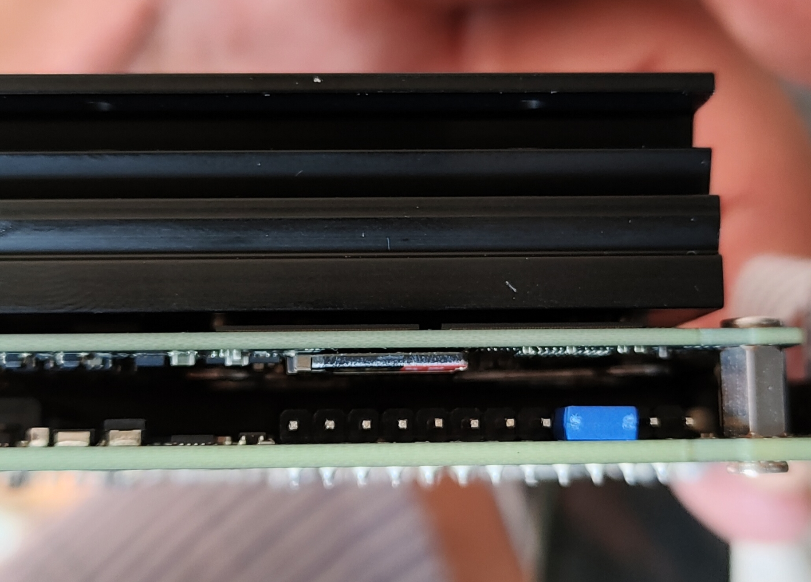

# Informations for developer

The Basler camera are currently mounted on iCub Humanoid robot attached on a [NVIDIA Jetson Xavier NX](https://developer.nvidia.com/embedded/jetson-xavier-nx-devkit) or [NVIDIA Jetson Nano](https://developer.nvidia.com/embedded/jetson-nano-developer-kit).

## Available features:

The available features exposed depends by the model of the device:
- [`daa4200-30mci`](https://docs.baslerweb.com/embedded-vision/available-features#daa4200-30mci)

## Network

The NVIDIA Nano is connecte p2p to the `icub-head` in the `10.0.0.x` network as follow:


It can be reached from outside through a routing rule passing through the `icub-head`.

### SSH

For connecting via ssh:
```bash
ssh -X nvidia@10.0.0.17
```
`pwd: nvidia`

### Internet acess to Nvidia board via Shorewall

**You need shorewall to access internet ONLY if the Nano/Xavier is not connected to icub-head**

Check and modify in file (you can find it in the repository) `shorewall/interfaces`

- internet access netcard (ZONE=net) with your internet card
- local access netcard (ZONE=lan) with your LAN net card

For check netcard names `ifconfig`

Do the same in `shorewall/masq` \<internet card\>\<lan card\>

Then

```
sudo apt-get install shorewall
sudo cp shorewall/* /etc/shorewall
sudo service shorewall start
```

:exclamation:<u>To be done on Nvidia.</u>

Configure the board address via GUI:
```
static
ip:10.0.0.17
netmask:255.255.255.0
gateway:<your static ip>
```
:exclamation:<u>Test</u>

Test from Nvidia `ping 8.8.8.8`

:warning:_Troubleshooting_

- Check if the Nvidia is running and is connected. 
- Check Nvidia address
- Check if eth board on icub-head is correctly configured

## Firmware

For flashing the [jetpack](https://developer.nvidia.com/embedded/jetpack) firmware rember the use the jumper as follow:



For normal use remove it.

## Software

If you are using a jetpack based on Ubuntu 18.04, you have to install `cmake` from kitware ppa.
```bash
sudo apt purge --auto-remove cmake
sudo apt update && \
sudo apt install -y software-properties-common lsb-release && \
sudo apt clean all
wget -O - https://apt.kitware.com/keys/kitware-archive-latest.asc 2>/dev/null | gpg --dearmor - | sudo tee /etc/apt/trusted.gpg.d/kitware.gpg >/dev/null
sudo apt-add-repository "deb https://apt.kitware.com/ubuntu/ $(lsb_release -cs) main"
sudo apt update
sudo apt install kitware-archive-keyring
sudo rm /etc/apt/trusted.gpg.d/kitware.gpg
sudo apt-key adv --keyserver keyserver.ubuntu.com --recv-keys 6AF7F09730B3F0A4
sudo apt update
sudo apt install cmake
sudo apt install cmake-curses-gui
```

# Notes

- From https://docs.baslerweb.com/pylonapi/cpp/pylon_programmingguide
Basler GigE cameras can be configured to send the image data stream to multiple destinations. Either IP multicasts or IP broadcasts can be used. For more information consult the advanced topics section.

